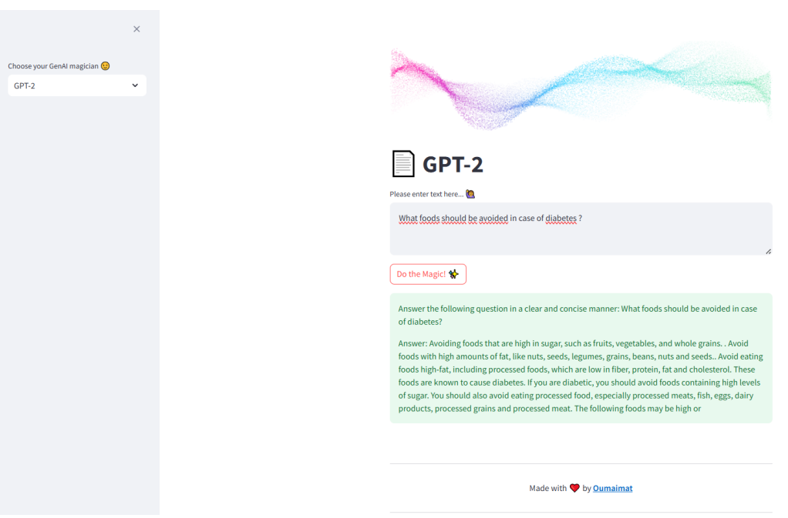
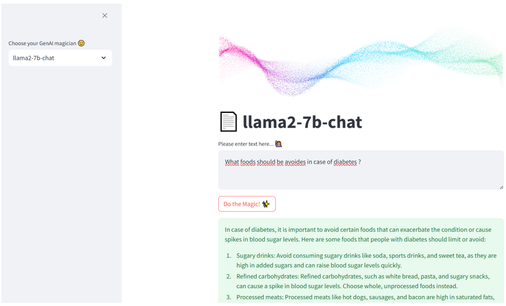
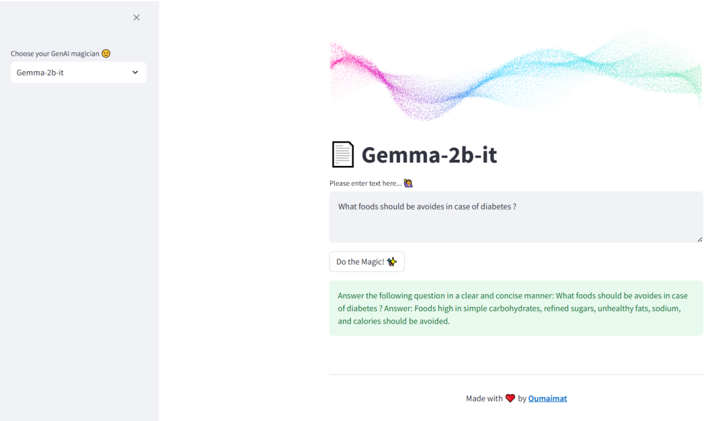

# Système Intelligent pour la Découverte des Interactions entre Maladies et Aliments

## Description du Projet
Ce projet vise à développer une plateforme intelligente capable de prédire les interactions entre des maladies et les aliments à éviter, en utilisant des techniques d'intelligence artificielle générative et de web scraping. Grâce à une application web intuitive, les utilisateurs peuvent poser des questions telles que _"Quels aliments dois-je éviter si je souffre de la maladie X ?"_ et recevoir des réponses basées sur des modèles fine-tunés sur des données spécifiques aux interactions aliments-maladies.

Le système est particulièrement utile pour les patients souffrant de maladies chroniques comme le diabète, les maladies cardiovasculaires, l'hypertension, les allergies alimentaires, etc., et vise à offrir une assistance dans la gestion des régimes alimentaires personnalisés.

Le projet comprend plusieurs phases clés :
1. **Collecte de données** via le web scraping du website https://www.passeportsante.net/.
2. **Préparation des données** et leur structuration pour entraîner les modèles d'IA.
3. **Modélisation avec fine-tuning** pour adapter les modèles d'IA à notre cas d'usage.
4. **Développement d'une interface utilisateur** accessible via une application web.
5. **Déploiement des modèles** pour une utilisation en production en temps réel.

## Fonctionnalités Clés
- **Web Scraping** : Extraction automatisée de données à partir de sources de santé reconnues (par exemple, PasseportSanté).
- **Préparation des Données** : Nettoyage, transformation et structuration des données collectées pour les rendre compatibles avec les modèles d'IA.
- **Modélisation avec IA** : Utilisation de modèles pré-entraînés comme GPT-2, LLama 2 et Gemma, adaptés aux interactions aliments-maladies grâce au fine-tuning.
- **Application Web** : Interface conviviale développée avec Streamlit, permettant aux utilisateurs de poser des questions et d'obtenir des recommandations personnalisées.
- **Déploiement des Modèles** : Hébergement des modèles fine-tunés avec Streamlit pour fournir des réponses en temps réel aux utilisateurs.

## Fine-Tuning des LLMs
Le fine-tuning des modèles est une étape essentielle du projet pour adapter les modèles pré-entraînés (tels que GPT-2, LLama 2 et Gemma) aux données spécifiques des interactions entre maladies et aliments. Ce processus améliore la pertinence des réponses fournies par les modèles.

### Étapes du Fine-Tuning
1. **Préparation des Données**  
   Le jeu de données est constitué de paires _questions-réponses_ qui relient des maladies à des aliments à éviter. Par exemple :
   - **Question** : _Quels aliments dois-je éviter si je souffre de diabète ?_
   - **Réponse** : _Évitez les aliments riches en sucre, tels que les bonbons, pâtisseries, boissons sucrées, etc._
   
   Les données sont nettoyées et formatées pour garantir une utilisation optimale lors du fine-tuning des modèles.

2. **Modèles Utilisés**  
   - **GPT-2** : Générateur de texte basé sur des architectures transformer, utilisé pour générer des réponses textuelles.
   - **LLama 2** : Modèle de Meta AI, utilisé pour des tâches de compréhension et génération de texte complexe.
   - **Gemma** : Modèle de Google AI, adapté à des prédictions basées sur des données multimodales dans le domaine de la santé.
## Interfaces des modèles

#### GPT 2

#### LLAMA 2

#### GEMMA

## Installation

### Prérequis
- Python 3.8 ou supérieur
- `pip` pour la gestion des paquets
- Un environnement virtuel (`virtualenv`) est recommandé pour isoler les dépendances
- Accès à un GPU recommandé pour entraîner les modèles (mais pas nécessaire pour l'utilisation en production)

### Cloner le dépôt
   git clone https://github.com/oumaimaab01/Disease-Food-chatbot.git

### Installation des dépendances
   pip install -r requirements.txt

### Démarrer l'Application Web
   streamlit run app.py

  

